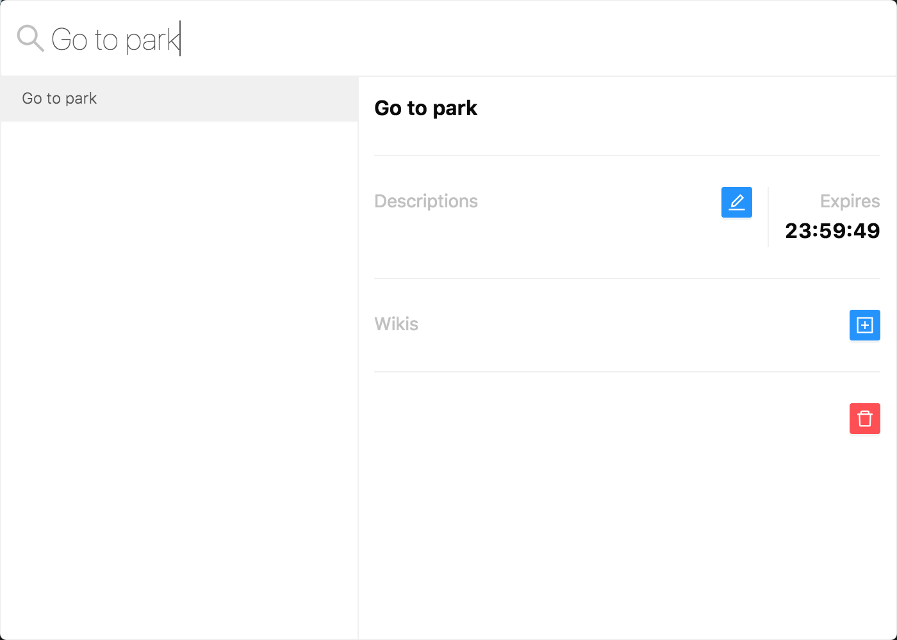

<h1 align="center">Neural</h1>

<p align="center">
  
</p>

## Start

```
yarn start
```

## Build

```
yarn build
```

## Sample

<p>
  
</p>

## How to use

### Command

```
# Create
> ${tag} + Enter

# Query
${tag}

# View All
@all + Enter
```

### Shortcut

```
# Evoke App
Command + >
```
